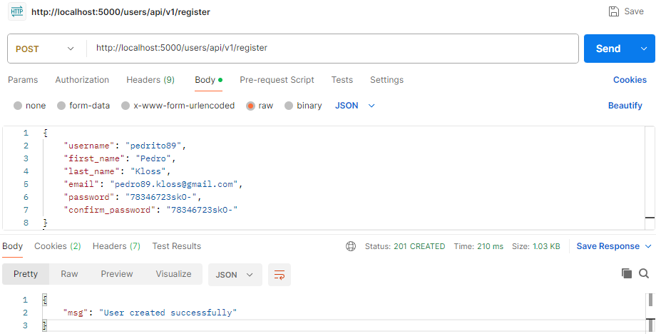
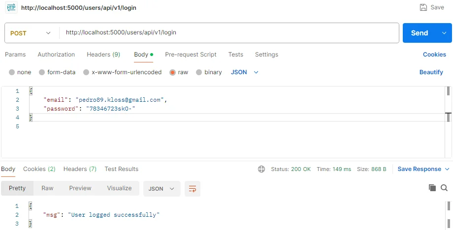
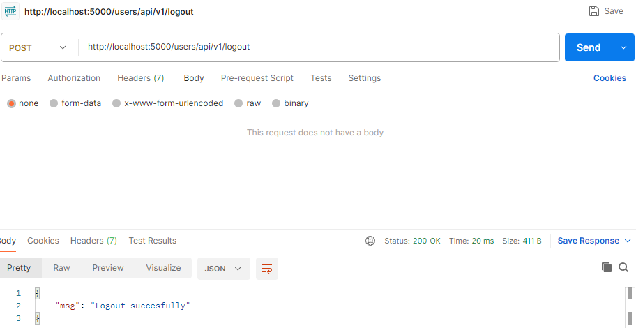
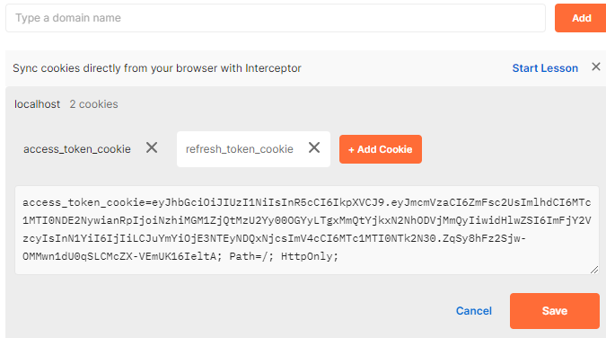
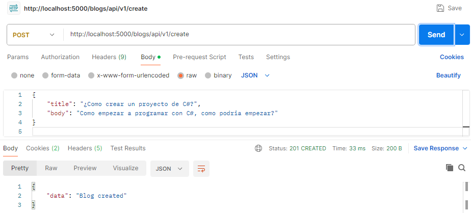
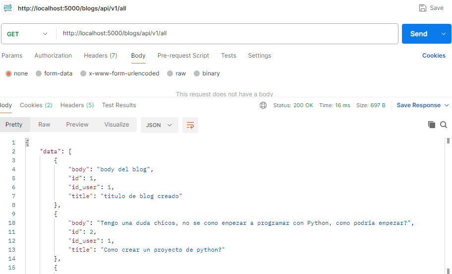
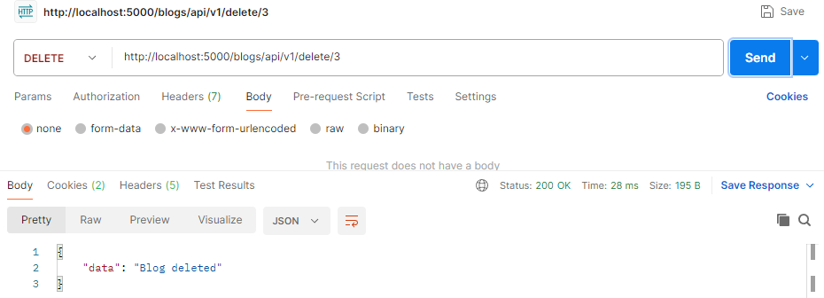
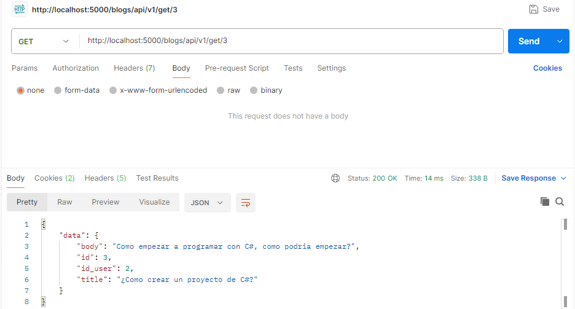
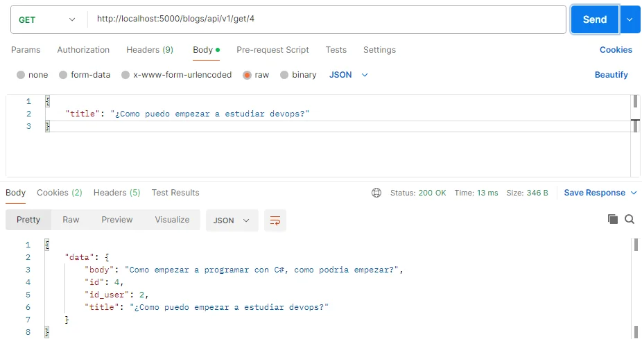
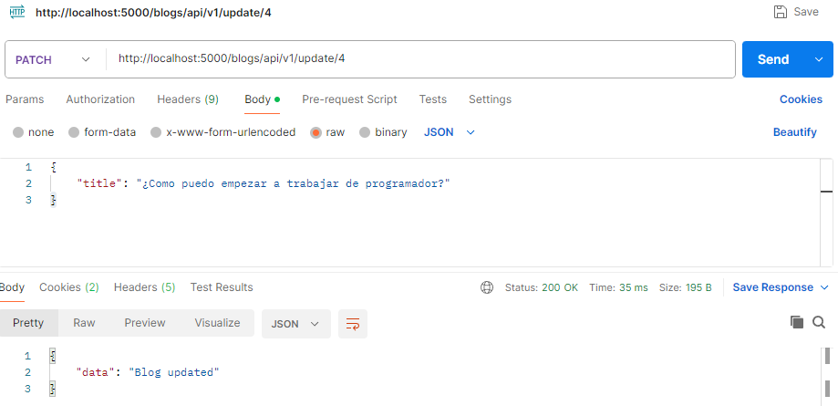

# API REST de Luzia

**Luzia** es una API REST desarrollada con Flask que ofrece una plataforma colaborativa para la creación de blogs. Los usuarios pueden crear y leer publicaciones de usuarios.


## 📋 Contenido

- [Requisitos funcionales](#requisitos-funcionales)
- [Funcionalidades](#funcionalidades)
- [Tecnologías utilizadas](#tecnologías-utilizadas)
- [Cómo iniciar el proyecto](#cómo-iniciar-el-proyecto)
  - [Uso con Docker Compose](#uso-con-docker-compose)
  - [Descarga manual en ZIP](#descarga-manual-en-zip)
- [Endpoints de la API](#endpoints-de-la-api)
  - [🟢 = No requiere auth | 🔒 = Requiere auth](#indicador)
  - [Usuarios](#usuarios)
  - [Publicaciones](#publicaciones)
- [Arquitectura utilizada](#arquitectura-utilizada)
- [Casos de uso](#casos-de-uso)

## Requisitos funcionales

* Python 3.10 o en adelante
* Docker 
* Docker compose

## Funcionalidades

### 🔐 Autenticación
- Registro e inicio de sesión de usuarios  
- Autenticación basada en tokens  
- Cierre de sesión seguro

### 📝 Gestión de Blogs
- Crear, editar y eliminar publicaciones de blog  
- Ver publicaciones propias o de otros usuarios


## Tecnologías utilizadas

**Lenguaje**  
- Python

**Framework**  
- Flask

**Base de datos**  
- MySQL

**Contenedores**  
- Docker

**Cache**  
- Redis


## Cómo iniciar el proyecto

### Uso con Docker Compose

1. Asegurate de tener instalado Docker y Docker Compose en tu sistema.

2. Cloná el repositorio:
```bash
git clone https://github.com/Carril-fol/luzia.git
```

3. Crear en la carpeta raíz del proyecto un archivo `.env`.

4. Crear las siguientes variables y asignarles valores:

```bash
MYSQL_ALLOW_EMPTY_PASSWORD="" # Esta variable permite acceder a la base de datos en caso de no tener contraseña.
MYSQL_ROOT_PASSWORD=""         # Tu contraseña, si es que tienes.
MYSQL_DATABASE=""              # Nombre de la base de datos.
MYSQL_USER=""                  # Nombre de usuario de la base de datos.
MYSQL_PASSWORD=""              # Contraseña del usuario de la base de datos.

FLASK_ENV="development"        # Estado del proyecto, actualmente en desarrollo.
JWT_SECRET_KEY=""              # Clave secreta para la generación de tokens JWT.
```

5. Abrir tu consola favorita.

6. Ejecutar el siguiente comando:
```bash
docker compose up --build
```

7. Abrir una herramienta de prueba (Postman, Insomnia).

8. Ingresar a `http://localhost:5000`.

9. Acceder a un endpoint; estos se encuentran en la sección de endpoints.


### Descarga manual en ZIP

1. Descargar el repositorio como archivo ZIP.

2. Extraerlo y mover la carpeta a la ubicación deseada.

3. Crear en la carpeta raíz del proyecto un archivo `.env`.

4. Crear las siguientes variables y asignarles valores:

```bash
MYSQL_ALLOW_EMPTY_PASSWORD="" # Esta variable permite acceder a la base de datos en caso de no tener contraseña.
MYSQL_ROOT_PASSWORD=""         # Tu contraseña, si es que tienes.
MYSQL_DATABASE=""              # Nombre de la base de datos.
MYSQL_USER=""                  # Nombre de usuario de la base de datos.
MYSQL_PASSWORD=""              # Contraseña del usuario de la base de datos.

FLASK_ENV="development"        # Estado del proyecto, actualmente en desarrollo.
JWT_SECRET_KEY=""              # Clave secreta para la generación de tokens JWT.
```

5. Abrir tu consola favorita.

6. Ejecutar el siguiente comando:
```bash
docker compose up --build
```

7. Abrir una herramienta de prueba (Postman, Insomnia).

8. Ingresar a `http://localhost:5000`.

9. Acceder a un endpoint; estos se encuentran en la sección de endpoints.


## Endpoints de la API

#### Indicador  
- 🟢 = No requiere autenticación  
- 🔒 = Requiere autenticación con token

### Usuarios

🟢 `POST /users/api/v1/register` – Registrar nueva cuenta

🟢 `POST /users/api/v1/login` – Iniciar sesión y obtener tokens

🔒 `POST /users/api/v1/logout` – Cerrar sesión

### Publicaciones

🔒 `POST /blogs/api/v1/create` – Crear una nueva publicación

🔒 `GET /blogs/api/v1/all` – Ver todas las publicaciones

🔒 `GET /blogs/api/v1/get/<id>` – Ver detalles de una publicación

🔒 `DELETE /blogs/api/v1/delete/<id>` – Eliminar una publicación

🔒 `PUT - PATCH /blogs/api/v1/update/<id>` – Actualizar una publicación


## Arquitectura utilizada

En este proyecto decidí implementar una **Arquitectura Clean** (Arquitectura Limpia) o también conocida como **Arquitectura en Capas**, donde cada componente cumple una responsabilidad específica:

- **Entidades (Entities):** representan el modelo de dominio y las reglas de negocio.  
- **Repositorios (Repositories):** encargados de la abstracción y gestión del acceso a los datos.  
- **Servicios (Services):** contienen la lógica de negocio y orquestan las operaciones entre entidades y repositorios.  
- **Controladores (Controllers):** manejan las solicitudes externas (por ejemplo, HTTP), interactúan con los servicios y devuelven las respuestas.

Esta separación permite un código más modular, fácil de mantener, escalar y testear.


## Casos de uso

Adjunto imagenes de Postman donde se ven como se interactura con la API.

### Usuarios

#### Registro

<div aling="center">
      
</div>

#### Iniciar Sesion

<div aling="center">
      
</div>

#### Cerrar Sesion

<div aling="center">
      
</div>

#### Tokens JWT

<div aling="center">
      
</div>


### Blogs

#### Crear Blog

<div aling="center">
      
</div>

#### Retornar todos los blogs

<div aling="center">
      
</div>

#### Borrar un blog

<div aling="center">
      
</div>

#### Retornar un blog

<div aling="center">
      
</div>

#### Actualizar un blog

##### Blog previamente de la actualización
<div aling="center">
      
</div>

##### Actualización del blog
<div aling="center">
      
</div>

##### Blog después de la actualización
<div aling="center">
      
</div>